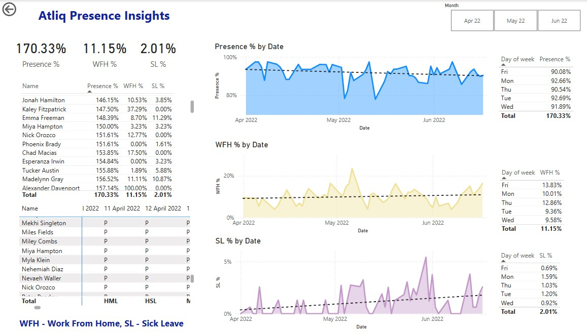

# HR Data Analytics - Power BI

## Project Overview

This project focuses on analyzing employee attendance data to derive insights that help optimize workforce planning and decision-making. Using Power BI, an interactive **Power BI** report was created to enable HR teams to track attendance trends, analyze work preferences, and manage resources efficiently.
## Business Objectives

The HR team at **Atliq Technologies** aimed to achieve the following:

- **Work Preferences Analysis**: Identify employee preferences for remote vs. office work.
- **Attendance Trend Analysis**: Calculate daily and monthly attendance percentages to improve workforce planning.
- **Hybrid Model Optimization**: Efficiently allocate office space in a hybrid work model.
- **Sick Leave Analysis**: Detect trends in sick leave to implement proactive measures.
- **External Factors Impact**: Analyze absenteeism trends influenced by external events (e.g., major sports events).

## Data Challenges & Transformation

The raw attendance data was stored in an Excel file, with each month's data spread across multiple worksheets. A major challenge was that each worksheet had dates as column headers (e.g., 1-Apr, 2-Apr, 1-May, 2-May), making it difficult to consolidate the data.

### Solution Approach

To ensure consistency and usability, the following data transformation steps were performed using **Power Query** in **Power BI**:

1. **Developed a Data Transformation Template**:
   - Extracted data dynamically without manually selecting column names.
   - Standardized column headers.
   - Unpivoted multiple date columns into a single column to improve data structure.

2. **Automated Transformation Across Worksheets**:
   - Created a **Power Query** function to apply the transformation to all monthly worksheets dynamically.
   - Used parameters to allow easy selection of different monthly data files.

3. **Final Data Cleaning**:
   - Removed unnecessary columns.
   - Converted the column data types and renamed the columns.

## DAX Measures for Attendance Insights and Metrics

Here are the DAX measures created to derive meaningful insights from the transformed data:

1. **Total Working Days**:
   ```DAX
   Total Working Days = 
     VAR totaldays = COUNT('Final Data'[Value])
     VAR nonworkdays = CALCULATE(COUNT('Final Data'[Value]), 'Final Data'[Value] IN {"WO","HO"})
     RETURN totaldays - nonworkdays
2. **WFH Count**:
   ```DAX
   WFH Count = SUM('Final Data'[WFH Count])
3. **Present Days**:
   ```DAX
   Present Days = 
     VAR presentdays = CALCULATE(COUNT('Final Data'[Value]), 'Final Data'[Value] = "P")
     RETURN presentdays + [WFH Count]
4. **Presence %**:
   ```DAX
   Presence % = DIVIDE([Present Days], 'Measure Table'[Total Working Days], 0)
5. **WFH %**:
   ```DAX
   WFH % = DIVIDE([WFH Count], [Present Days], 0)
6. **SL Count**:
   ```DAX
   SL Count = SUM('Final Data'[SL Count])
7. **Total Working Days**:
   ```DAX
   SL % = DIVIDE([SL Count], [Total Working Days], 0)

# Atliq Presence Insights Report

This Power BI report provides a comprehensive analysis of employee attendance, work-from-home (WFH) trends, and sick leave (SL) patterns over time. It offers key metrics and insights into employee presence, helping organizations monitor and improve workforce productivity and well-being.



## Key Metrics

### Cards on Top
- **Presence %**: The overall percentage of employees present at work.
- **WFH %**: The percentage of employees working from home.
- **SL %**: The percentage of employees on sick leave.

## Employee Attendance Table

The table displays individual employee attendance, along with their **Presence %**, **WFH %**, and **SL %** for easy comparison and analysis.

## Presence % by Date

This area chart tracks employee presence over time, with a trendline to highlight fluctuations in overall attendance.

## WFH % by Date

This area chart shows the percentage of employees working from home each day, emphasizing trends and peak WFH periods.

## SL % by Date

This area chart tracks sick leave trends over time, helping identify spikes in employee absences.

## Day-of-Week Analysis

These tables break down **Presence %**, **WFH %**, and **SL %** by each day of the week, offering insights into recurring patterns, such as higher WFH rates on Fridays.

## Employee Attendance Log

A detailed log of daily employee attendance, showing:
- Employee name
- Attendance codes for presence, WFH, SL, etc...

## Acknowledgment

This project was inspired by **Codebasics (YouTube Channel)**. Thanks to them for providing a structured learning experience!
